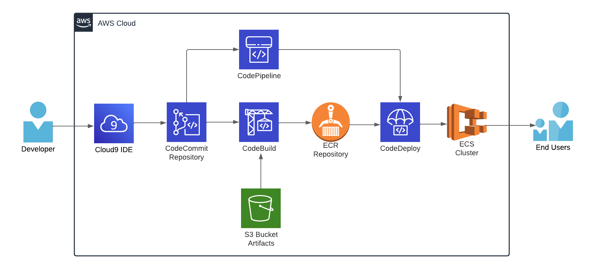

This Project Aims to create a CI/CD Pipeline in AWS For ECS cluster using the following services:
    - AWS CodeCommit
    - AWS CodeBuilt
    - AWS CodeDeploy
    - AWS CodePipeline

1. Create a Code Commit Repository and Push the code
    - Open the AWS Console - In side Developer tools - Search CodeCommit - Repositories - Create - Add name - Create

2. Create ECR Private Repository
    - Navigate to Amazon ECR - Repositories - Create - Private - Keep the rest of the settings Default - Create.

3. Create CodeBuild Build Project
    - Navigate to Developer Tools - CodeBuild - Build Projects - Create Build Project - Add a project name - Keep the rest as Default 
    - In Source - Source 1 Primary Select Source Provider as CodeCommit - Add Your Repo - In Reference type select Branch - In Branch Select master 
    - In Environment Image Select managed image - Operating System (Amazon Linux 2) - Runtime Standard - Image version Select (Always use the latest image for this runtime version) - environment type (Linux) - Enable the Priviledged Box
    - In service role - Select New Service Role - add A role name - Additional configurations - Add Default Region - AWS account ID - Image_tag - Image repo name - (Type should be Plaintext in the Type Dropdown)
    - In Logs - Enable CloudWatch Logs - group name - Stream name - Create Build Project

4. Edit CodeBuild ECR Access Policy
    - Choose JSon - Add the `(codebuild-ecs-cicd)` Policy .

5. Create One File for CodeBuild , `(buildspec.yml)`

6. In CodeBuild Project, Click start build and Check the status

7. Check AWS ECR Repo and Check if the Docker Image is created.

8. Create AWS CodePipeline for CI/CD
    - Navigate back to Developer tools - CodePipeline - Pipelines - Create New Pipeline - Add name - New Service role - Add a Role name - Enable Code Pipeline to create Service role - Advanced Settings - Default location.
    - Add Source stage - In Source Provide  select CodeCommit - Select the repository name - Branch name - Change Detection option - select cloudwatch events - In Outputs Artifact format - Select CodePipeline Default - Next
    - Add build stage - In build provider select AWS CodeBuild - select region - Enter Project Name - In build type select single Build - Next - Review above steps and create pipeline

9. Create an ECS Cluster 
    - Navigate to ECS - Create Cluster - Add Cluster name - Select Default VPC and Subnets.

10. Create Task Definition for ECS 
    - In ECS - Create New Task Definition - Add Task name - In container - Add name - Image URI - in Port mappings - Container Port (80) - Protocol (TCP) - Port name - App Protocol (Https)
    - In environtment Settings - App environment Select AWS Fargate(Serverless) - Operating System (linux/X86_64) - Task Size CPU (.5 vCPU and Memory 1GB) - Task Role and Task Execution role Select Ecs Task Role 
    - In task definition in ECS Check if the task is created and is active.

11. Create Security group for ECS
    - In EC2 - Security Groups - Create Security group - Enter name - default VPC - In Inbound Rules - Select Type (Http) - Source (Anywhere or 0.0.0.0/0)

12. Create Service for ECS
    - Navigate to ECS - Task Definition - Select Create Task Definition - Create Service - Add Exisiting Cluster - Compute Options Select Launch type - Launch Type (Fargate) - Platform Version (latest) - Service name - Add a name for the service - Service Type Select Replica - Desired Tasks (1) - Min Running tasks% (100) - maximum running tasks% (200) - Select Default VPC, Subnets, use existing Security group and Turn Public IP on.

13. Go to Service - Copy task's Public IP - Paste the IP in the Browser and Check that the website is deployed.

14. Add CodeDeploy stage for CodePipeline 
    - Navigate to Developer tools - CodePipeline - Pipeline - Edit - Edit Name - Action Provider Select ECS - Add Region - Input artifsct select BuildArtifact - Cluster name Default server name - Service Name Select the service role created - in ImageDefinitions file - imagedefinitions.json

15. Rekease a New Version of your application and you can see the codepipeline is triggering and the application is up and running.     

15. Clean Up resources
    - AWS ECS: Remove Service, Task Definition & Cluster.
    - AWS Dev Tools: Remove CodePipeline, CodeBuild, CodeDeploy & CodeCommit Repository.
    - AWS S3: Remove Artefact Bucket.
    - AWS IAM: Remove Service Role.
    - AWS ECR: Remove the repository.
    - AWS EC2 Security Group: Remove the SG